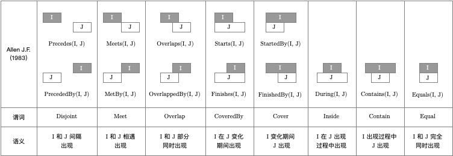

# 日期时间相关函数

## 函数

### `DATETIME_INTERVAL_RELATION`

计算两个日期时间区间的关系。

```sql
CREATE TEMPORARY FUNCTION
  DATETIME_INTERVAL_RELATION
AS
  'tech.leovan.hive.udf.datetime.DatetimeIntervalRelationUDF';
```

#### 参数

- FIRST_START_DATETIME（必选）：`STRING` 类型，第一个开始日期时间，格式为 `yyyy-MM-dd HH:mm:ss`
- FIRST_END_DATETIME（必选）：`STRING` 类型，第一个结束日期时间，格式为 `yyyy-MM-dd HH:mm:ss`
- SECOND_START_DATETIME（必选）：`STRING` 类型，第二个开始日期时间，格式为 `yyyy-MM-dd HH:mm:ss`
- SECOND_END_DATETIME（必选）：`STRING` 类型，第二个结束日期时间，格式为 `yyyy-MM-dd HH:mm:ss`

#### 返回值

日期时间区间关系名称：`STRING` 类型

可能得返回值包括：`Precedes`，`PrecededBy`，`Meets`，`MetBy`，`Overlaps`，`OverlappedBy`，`Starts`，`Finishes`，`StartedBy`，`FinishedBy`，`During`，`Contains`，`Equals`，`FormatError`，`ValueError`。

当参数的格式错误时，例如：`1970/01/01 00:00:00`，返回 `FormatError`。

当参数的值错误时，例如：第一个开始日期时间大于第一个结束日期时间，返回 `ValueError`。

其他返回值对应的关系如下图所示：



函数允许两个开始日期时间和结束日期时间相同，即允许比较时间点。当存在相同的日期时间时，不同的关系名称可能表示相同的含义，此时优先选择上述返回值左边的关系名称。例如，当第一个为日期时间点，第二个为日期时间区间时，`Meets` 和 `Starts` 表示相同的含义，此时函数会返回 `Meets`。

#### 示例

SQL：

```sql
SELECT
  DATETIME_INTERVAL_RELATION(
    '1990/01/01 00:00:00',
    '1990/01/02 00:00:00',
    '1990/01/03 00:00:00',
    '1990/01/04 00:00:00'
  )
;
```

输出结果为：

```txt
FormatError
```

SQL：

```sql
SELECT
  DATETIME_INTERVAL_RELATION(
    '1990-01-02 00:00:00',
    '1990-01-01 00:00:00',
    '1990-01-03 00:00:00',
    '1990-01-04 00:00:00'
  )
;
```

输出结果为：

```txt
ValueError
```

SQL：

```sql
SELECT
  DATETIME_INTERVAL_RELATION(
    '1990-01-01 00:00:00',
    '1990-01-02 00:00:00',
    '1990-01-03 00:00:00',
    '1990-01-04 00:00:00'
  )
;
```

输出结果为：

```txt
Precedes
```
